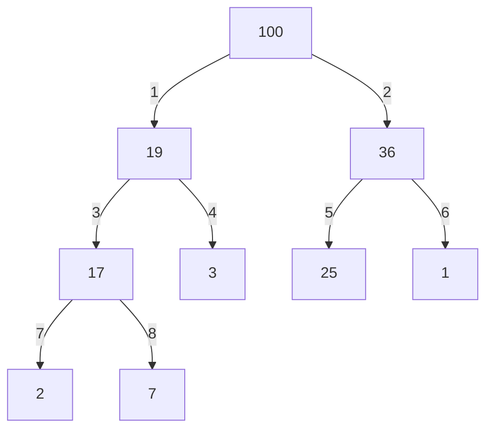

## 优先队列

优先队列(最大堆，最小堆)是一种用**完全二叉树**实现的数据结构，用于维护一组元素，并且能快速找到元素中的最大值或最小值。其底层实现有多种，常见的有以下几种：

- 二叉堆（Binary Heap）：二叉堆是优先队列最常用的实现方式，包括最大堆和最小堆。它是一种完全二叉树，其中每个节点都大于或等于（最大堆）或小于或等于（最小堆）其子节点。二叉堆可以通过数组实现，时间复杂度为 O(log n)。
  - 优点：实现简单，性能稳定。插入，删除，查找最大/最小元素的时间复杂度都是O(log n)。
  - 缺点：如果需要删除堆中的任意元素，时间复杂度会上升到O(n)。对于频繁的任意元素删除操作，可能会成为瓶颈。
  - 适用场景：常见于各种需要使用优先队列的算法中，如Dijkstra的最短路径算法，堆排序等。
- 斐波那契堆（Fibonacci Heap）：斐波那契堆是一种优化过的堆，对于一些操作提供了比二叉堆更优的平均时间复杂度。但由于其实现复杂度较高，所以在实际使用中并不常见。
  - 优点：某些操作的摊还时间复杂度非常低，如插入和减小关键字的时间复杂度是O(1)，合并的时间复杂度也是O(1)。
  - 缺点：实现复杂，常数因子较大，所以在实际应用中可能性能并不如预期。
  - 适用场景：在需要大量合并操作或者减小关键字操作的场合下，使用斐波那契堆可能会有优势，如改进版的Dijkstra算法和Prim算法。
- 配对堆（Pairing Heap）：配对堆是一种形式简单、操作高效的堆结构，主要用于实现优先队列。它的主要优点是实现简单，且在实践中具有良好的效果。
  - 优点：实现相对简单，某些操作的摊还时间复杂度较低，如插入，查找最小元素的时间复杂度为O(1)，删除最小元素的时间复杂度为O(log n)。
  - 缺点：最坏情况下的时间复杂度可能比较高，且理论上的时间复杂度上界并未完全解决。
  - 适用场景：在实际应用中，配对堆通常可以替代二叉堆和斐波那契堆，性能表现良好。
- 数组或链表：对于小规模数据，可以直接使用数组或链表来实现优先队列。对于数组，每次添加元素时将其放到正确的位置以保持数组有序；对于链表，每次添加元素时将其放到正确的位置以保持链表有序。这两种方法的时间复杂度较高，一般为 O(n)，但对于小规模数据可能是可以接受的。
  - 优点：实现简单，不需要额外的数据结构知识。对于小规模数据，性能可以接受。
  - 缺点：插入和删除元素的时间复杂度为O(n)，随着数据规模的增大，性能下降明显。
  - 适用场景：小规模数据的优先队列，或者只需要一次性构建优先队列后进行一系列的取最大/最小元素操作。
- 二项队列（Binomial Queue）跳跃列表（Skip List）：这两种数据结构也可以用来实现优先队列，但相对来说并不常见。

## 图



对应的数组

```
[100, 19, 36, 17, 3, 25, 1, 2, 7]
```

将堆的元素存储在数组中，其中索引 `i` 的父节点的索引为 `i/2`（这里假设索引从1开始）。更准确地说，如果我们使用整数除法（即除法后直接去掉余数），那么元素 `i` 的父节点应为 `i/2`。

同样的，如果我们从0开始索引，父子节点关系有所不同，子节点 `i` 的父节点应为 `(i-1)/2` 或 `i//2` （向下取整）。